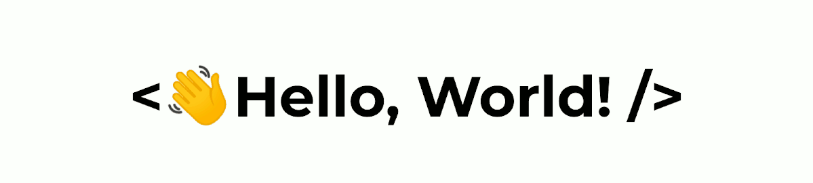

    

  

### 
I am Ludal, a 21 yo french 🇫🇷 dev lover, mainly interested in   web development and DevOps. 👨‍💻

    
    
    
    

  
 

- 🔭 Currently working on [Aïkido Roncq](https://www.aikido-roncq.fr).

- ⚡ Fun fact: emoji lover. ❤️  

## 👨‍💻 What I've Done

    
[🥋 Aïkido Roncq](https://www.aikido-roncq.fr) | [⌨️ Typospeed](http://iamludal.fr/typospeed) | [⚙️ MySQL-QueryBuilder](https://github.com/iamludal/MySQL-Querybuilder)  
--- | --- | ---

## ⚡ My Skill Set

<table>
    <thead>
        <tr>
            <th>Frontend</th>
            <th>Backend</th>
            <th>Databases</th>
            <th>Other</th>
        </tr>
    </thead>
    <tbody>
        <tr>
            <td>
               
               
               
               
               
            </td>
            <td>
                
                
                
            </td>
            <td>
                
                
            </td>
            <td>
                 
                
                
                
            </td>
        </tr>
    </tbody>
</table>

## 📈 My Stats

   
    

